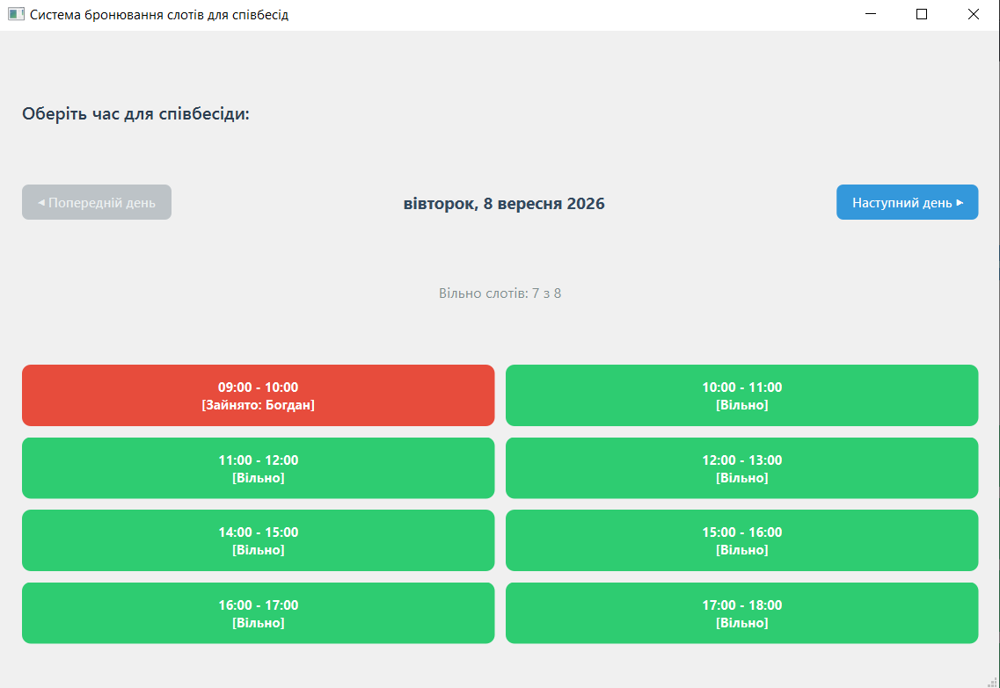

# Система бронювання слотів для співбесід (Interview Booking System)
Десктопний застосунок мовою **C++** із використанням фреймворку **Qt Widgets**, розроблений у межах виконання індивідуального завдання з навчальної практики.

Застосунок призначений для автоматизації роботи рекрутера/HR-фахівця: він дозволяє переглядати розклад інтерв'ю по днях, бронювати вільні часові слоти з вказуванням ім'я кандидата, скасовувати бронювання та автоматично зберігати стан розкладу у локальний файл.

---

## 🚀 Основні можливості

- 📅 **Перегляд розкладу по днях:** Навігація між датами («Попередній день» / «Наступний день»).
- 🟩 **Візуалізація станів:**
  - **Зелений колір** — слот вільний для бронювання.
  - **Червоний колір** — слот заброньовано (відображається ім'я кандидата).
- 👤 **Інтерактивне бронювання:** При кліку на вільний слот відкривається діалогове вікно для введення імені кандидата.
- ❌ **Скасування бронювання:** Можливість скасувати запис при повторному кліку на заброньований слот.
- 💾 **Автоматичне збереження та завантаження (Persistence):**
  - Усі зміни автоматично зберігаються у файл `schedule.json` у форматі **JSON**.
  - При запуску програми стан відновлюється, тому заброньовані раніше слоти залишаються недоступними.
  - Захист від пошкоджених файлів конфігурації.
- 💡 **Розумні підказки:** Якщо всі слоти на обраний день заповнені, система пропонує автоматично перейти на наступний день.

---

## 🛠 Технологічний стек

- **Мова програмування:** C++17 (або C++11+)
- **Фреймворк:** Qt 5 / Qt 6 (Qt Widgets)
- **Модулі Qt:** `QtCore`, `QtGui`, `QtWidgets`
- **Формат даних:** JSON (`QJsonDocument`, `QJsonObject`, `QJsonArray`)
- **Cистема збирання:** CMake / qmake
- **IDE:** Qt Creator / CLion / VS Code

---

## 🧱 Архітектура та структура проекту

Проект побудовано за принципами об'єктно-орієнтованого програмування (ООП) із чітким розділенням відповідальності (Clean Architecture / MVC pattern):

| Файл | Опис модуля / класу |
| :--- | :--- |
| `timeslot.h` | **`TimeSlot`** — структура даних одного часового слота (час, прапорець `isBooked`, ім'я кандидата `bookedBy`). |
| `schedule.h` / `.cpp` | **`Schedule`** — клас бізнес-логіки. Керує розкладом на різні дати (`QMap<QDate, QVector<TimeSlot>>`), відповідає за бронювання, скасування та підрахунок вільних слотів. |
| `schedulestorage.h` / `.cpp` | **`ScheduleStorage`** — клас для роботи з файловою системою. Відповідає за серіалізацію/десеріалізацію розкладу в/з JSON-файлу (`schedule.json`). |
| `mainwindow.h` / `.cpp` | **`MainWindow`** — графічний інтерфейс (UI). Формує сітку кнопок, обробляє події користувача, оновлює стилі (QSS) та пов'язує UI з логікою `Schedule`. |
| `main.cpp` | Точка входу в програму. |

---

## 📂 Структура JSON-файлу збереження (`schedule.json`)

```json
{
  "scheduleName": "Розклад співбесід",
  "days":
  {
    "2026-09-08":
    [
      {
        "bookedBy": "Іван Петренко",
        "isBooked": true,
        "time": "09:00 - 10:00"
      },
      {
        "bookedBy": "",
        "isBooked": false,
        "time": "10:00 - 11:00"
      }
    ]
  }
}
```

## 🔧 Встановлення та запуск

### Вимоги:
* **Qt SDK:** версія 5.15+ або 6.x (компоненти Qt Widgets).
* **Компілятор:** GCC / MSVC / Clang із підтримкою C++17.
* **Система збирання:** CMake (версії 3.16+) або qmake.

### Кроки для запуску через Qt Creator:
1. Клонуйте репозиторій:
   ```bash
   git clone [https://github.com/WhatTheDuck08/InterviewBookingSystem.git](https://github.com/WhatTheDuck08/InterviewBookingSystem.git)
   ```
2. Відкрийте файл CMakeLists.txt у Qt Creator.
3. Оберіть ваш комплект збирання (Kit).
4. Натисніть Запустити (Ctrl + R).

## Скріншоти програми



