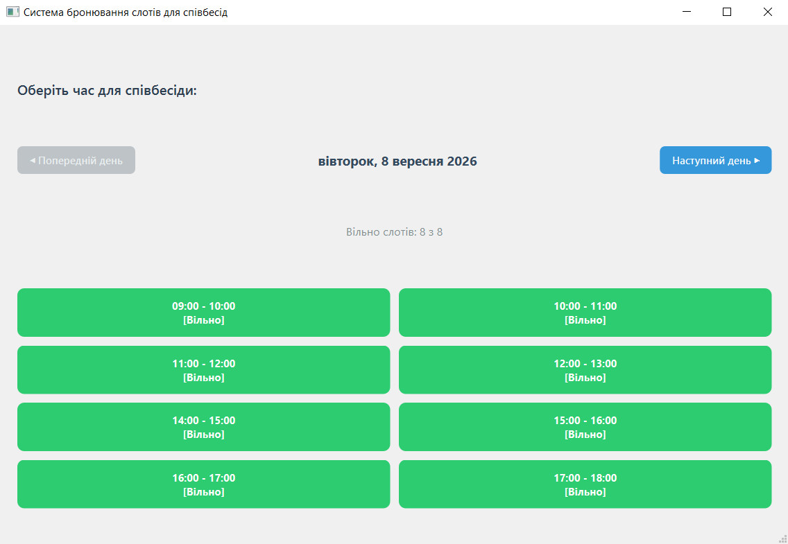
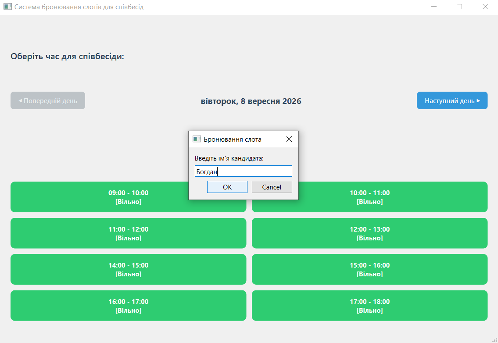

# Interview Booking System (Qt C++)

Настільний застосунок для автоматизації бронювання часових слотів (наприклад, для співбесід чи консультацій), розроблений мовою **C++** з використанням фреймворку **Qt Widgets**.

---

## 🚀 Основні можливості

* **Візуальний графічний інтерфейс**: Зручна сітка слотів із динамічною зміною кольору залежно від стану (вільно/зайнято).
* **Інтерактивна реєстрація**: При виборі вільного слота викликається діалогове вікно для введення імені користувача.
* **Збереження стану (Persistence)**: Всі записи автоматично зберігаються у файл `schedule.json` та відновлюються під час повторного запуску програми.
* **Скасування бронювання**: Повторний клік по заброньованому слоту дозволяє звільнити час.

---

## 🛠 Технології та концепції

* **C++17** / **Qt 6** (Qt Widgets, QtCore, QtGui)
* **CMake** — система збірки
* **JSON (QJsonDocument, QJsonObject, QJsonArray)** — збереження даних
* **OOP & Signals/Slots** — архітектура додатка та обробка подій UI
* **QGridLayout & QVBoxLayout** — адаптивна компоновка віджетів

---

## 📂 Структура проєкту

* `main.cpp` — точка входу в програму.
* `mainwindow.h` / `mainwindow.cpp` — основна логіка інтерфейсу, обробка подій та робота з JSON.
* `mainwindow.ui` — візуальна форма вікна.
* `CMakeLists.txt` — конфігурація збірки проєкту.

---

## 🔧 Як запустити проєкт

1. Клонуйте репозиторій або завантажте сирцевий код.
2. Відкрийте файл `CMakeLists.txt` у **Qt Creator**.
3. Оберіть комплект збірки (наприклад, Desktop Qt MinGW / MSVC).
4. Натисніть **Run** (`Ctrl + R`).

---

## 📝 Історія комітів (Conventional Commits)

Проєкт розроблявся із дотриманням стандартів ведення історії Git:
1. `init` — початкова структура проєкту.
2. `feat: add slot grid UI and state toggle logic` — побудова сітки слотів та базової логіки.
3. `feat: add user name input on slot reservation` — додавання реєстрації імені через `QInputDialog`.
4. `feat: implement schedule state persistence with JSON` — повноцінне збереження та завантаження розкладу.

## Скріншоти програми

